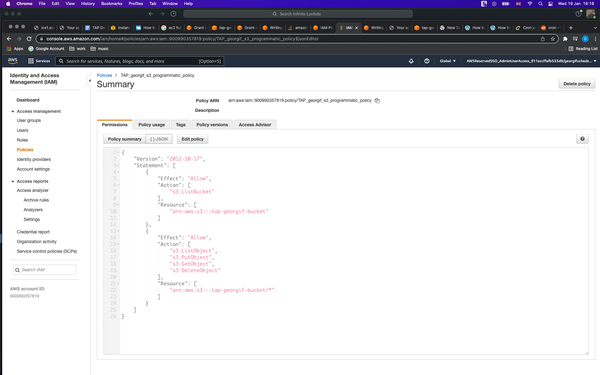

## AWS lab 2:

### Task 1:
Machine creation:

```bash
aws ec2 run-instances --image-id ami-05cafdf7c9f772ad2 --count 1 --instance-type t2.micro --key-name TAP_georgif --security-group-ids sg-0523f8a9602301934 --subnet-id subnet-0f5550982c861d958
```

### Task 2:

SSH key deletion:

```bash
ssh -i /Users/gf/Documents/TAP_georgif.pem ec2-user@3.71.17.75 id; rm ~/.ssh/authorized_keys
```

Using this guide for the recovery:

[https://docs.aws.amazon.com/AWSEC2/latest/UserGuide/replacing-lost-key-pair.html#step-3-stop-original-instance]


Executed commands on the recovery instance:

```bash
sudo mount -o nouuid /dev/xvdf1 /mnt/temp

sudo cp .ssh/authorized_keys /mnt/temp/home/ec2-user/.ssh/authorized_keys

sudo ls -l /mnt/temp/home/ec2-user/.ssh

sudo chown -R ec2-user:ec2-user /mnt/temp/home/ec2-user/.ssh

ls -l .ssh/authorized_keys 

sudo umount /mnt/temp/
```

Connecting back on the first instance:

```bash
ssh -i /Users/gf/Documents/TAP_georgif.pem ec2-user@3.124.4.209 id;uptime
```

```bash
uid=1000(ec2-user) gid=1000(ec2-user) groups=1000(ec2-user),4(adm),10(wheel),190(systemd-journal)
10:30:57 up 0 min,  0 users,  load average: 0.57, 0.15, 0.05
```

Deleted the recovery instance.

### Task 3:

Created new instance, which is not in the default security group and subnet:

```bash
ssh -i ~/Documents/TAP_georgif.pem ec2-user@18.159.207.61 'id'
```

```bash
uid=1000(ec2-user) gid=1000(ec2-user) groups=1000(ec2-user),4(adm),10(wheel),190(systemd-journal)
```

Deleted the rule from the security group.


Created SM role, attached and connected to the instance via SM:


### Task 4:

Allowed ports 22 and 80 from security group and installed nginx on the instance:

```bash
ssh -i /Users/gf/Documents/TAP_georgif.pem ec2-user@18.159.207.61 netstat -4ltn | grep "22\|80"
```

```bash
tcp        0      0 0.0.0.0:80              0.0.0.0:*               LISTEN     
tcp        0      0 0.0.0.0:22              0.0.0.0:*               LISTEN     
```

```bash
curl -IL 18.159.207.61
```

```bash
HTTP/1.1 200 OK
Server: nginx/1.20.0
Date: Wed, 19 Jan 2022 12:33:38 GMT
Content-Type: text/html
Content-Length: 3520
Last-Modified: Thu, 15 Jul 2021 21:46:50 GMT
Connection: keep-alive
ETag: "60f0acca-dc0"
Accept-Ranges: bytes
```

### Task 5:

Creating s3 bucket:

```bash
aws s3api create-bucket --bucket tap-georgif-bucket --region eu-central-1 --create-bucket-configuration LocationConstraint=eu-central-1
```

Creating policy, role and attach it to the instance:




Installing s3fs-fuse, configuring /etc/fstab and setting up cron job to sync the contents of nginx html to /var/s3-bucket-tap-name every 1 hour:

```bash 
sudo yum update

sudo yum search automake

sudo yum install automake fuse fuse-devel gcc-c++ git libcurl-devel libxml2-devel make openssl-devel

git clone https://github.com/s3fs-fuse/s3fs-fuse.git

cd s3fs-fuse/

./autogen.sh 

./configure --prefix=/usr --with-openssl

make

sudo make install

which s3fs

sudo vi /etc/fstab 
```

```bash
#
UUID=0a56d206-2a6d-46e6-b65f-11b7052f72cf     /           xfs    defaults,noatime  1   1

s3fs#tap-georgif-bucket /var/s3-bucket-tap-georgif/ fuse _netdev,allow_other,uid=1002,gid=1002,iam_role=TAP_georgif_s3_programmatic_role,use_cache=/tmp,url=https://s3.eu-central-1.amazonaws.com 0 0
```

```bash
sudo mount -a

df -h
```

```bash
Filesystem      Size  Used Avail Use% Mounted on
devtmpfs        475M     0  475M   0% /dev
tmpfs           483M     0  483M   0% /dev/shm
tmpfs           483M  444K  483M   1% /run
tmpfs           483M     0  483M   0% /sys/fs/cgroup
/dev/xvda1      8.0G  2.1G  6.0G  26% /
tmpfs            97M     0   97M   0% /run/user/1000
s3fs             16E     0   16E   0% /var/s3-bucket-tap-georgif
```

```bash
touch /var/s3-bucket-tap-georgif/hello 

crontab -e

crontab -l
```
   
```bash
0 * * * * sudo cp -r /usr/share/nginx/html/ /var/s3-bucket-tap-georgif/
```
