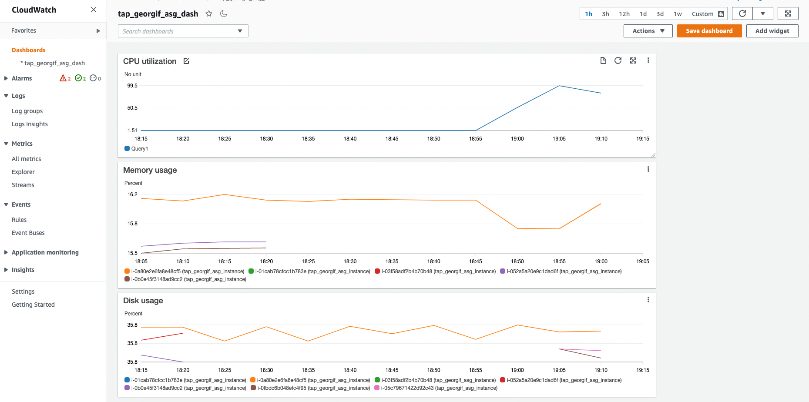

## AWS lab 4:

### Tasks 4 b and 5 c (also present in yesterday's README.md at https://github.com/gfilworkacc/TAP_devops_track/tree/main/aws_lab3):

Created the log policy and attached it to existing role:


Installed and configured awslogs daemon on the instance:

```bash
sudo yum update 

sudo yum install -y awslogs

sudo systemctl start awslogsd

sudo systemctl status awslogsd

sudo vi /etc/awslogs/awslogs.conf 
```

Appended the following to configuration file:

```bash
[/var/log/nginx/access.log]
datetime_format = %d/%b/%Y:%H:%M:%S %z
file = /var/log/nginx/access.log
buffer_duration = 5000
log_stream_name = access.log
initial_position = end_of_file
log_group_name = tap_georgif_log_group
```

```bash
sudo systemctl restart awslogsd
```

Created a log group:


Changed crontab to execute "aws s3 sync" instead of cp:

```bash
0 * * * * aws s3 sync /usr/share/nginx/html s3://tap-georgif-bucket/html
```

### Task 6:

Before creating image, installed amazon-cloudwatch-agent and stress command on the source machine:

```bash
sudo amazon-linux-extras install epel -y

sudo yum install stress -y

sudo yum install amazon-cloudwatch-agent

amazon-cloudwatch-agent-config-wizard

sudo /opt/aws/amazon-cloudwatch-agent/bin/amazon-cloudwatch-agent-config-wizard

systemctl status amazon-cloudwatch-agent

sudo /opt/aws/amazon-cloudwatch-agent/bin/amazon-cloudwatch-agent-ctl -a fetch-config -m ec2 -s -c file:/opt/aws/amazon-cloudwatch-agent/bin/config.json 

/opt/aws/amazon-cloudwatch-agent/bin/amazon-cloudwatch-agent-ctl -m ec2 -a status
```

Created image from the source machine for the auto-scaling group:


Created launch configuration:


Created auto-scaling group:


### Task 7:

Created cloud watch dashboard with the requested metrics, but CPU graph needs to be double checked:



### Task 8:

Need to figure out how to set the alarms properly, stress and auto-scale group are  working :


