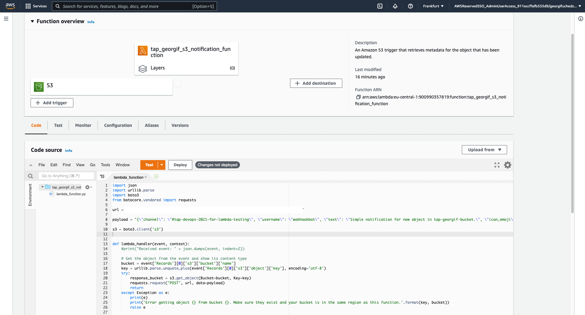

## AWS lab 5:

### Task 1:

Followed this guide https://docs.aws.amazon.com/AmazonS3/latest/userguide/HostingWebsiteOnS3Setup.html :

- Enabled static website hosting;

- Allowed public access;

- Added bucket policy:


S3 bucket in now publicly accessible for reading:

```bash
curl -IL http://tap-georgif-bucket.s3-website.eu-central-1.amazonaws.com/index.html
```

```bash
HTTP/1.1 200 OK
x-amz-id-2: HLEWOnbKGY8NOpKUA1tN2bh7cRNcQFYWdLIwsax5V6cooHtXQn/YCrqiJYsGnAuX4ip8g5zdyg4=
x-amz-request-id: K646YCHQD0M1PDR3
Date: Fri, 21 Jan 2022 10:39:52 GMT
Last-Modified: Fri, 21 Jan 2022 10:25:51 GMT
ETag: "6ea250d1b4ead3a22f412c74d29ac817"
Content-Type: text/html
Server: AmazonS3
Content-Length: 3520
```

### Task 2:

Follow this guide https://docs.aws.amazon.com/lambda/latest/dg/with-s3-example.html#with-s3-example-configure-event-source for Lambda function creation :

Created the function and added the S3 trigger separately:


Used pre-generated function code, Webhook URL and POST method example and altered the function code like this:



### Task 3:

Created CloudFront distribution for the S3 bucket, which is available at https://dq7ocfuyw4rz4.cloudfront.net/index.html


