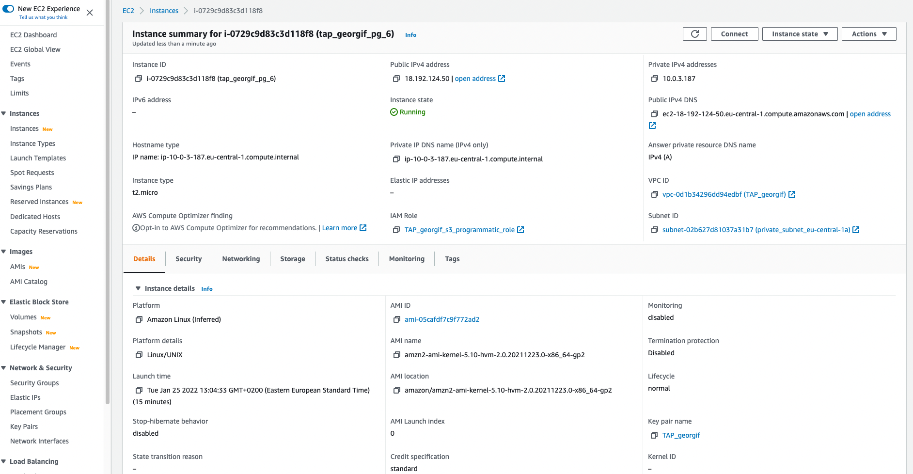
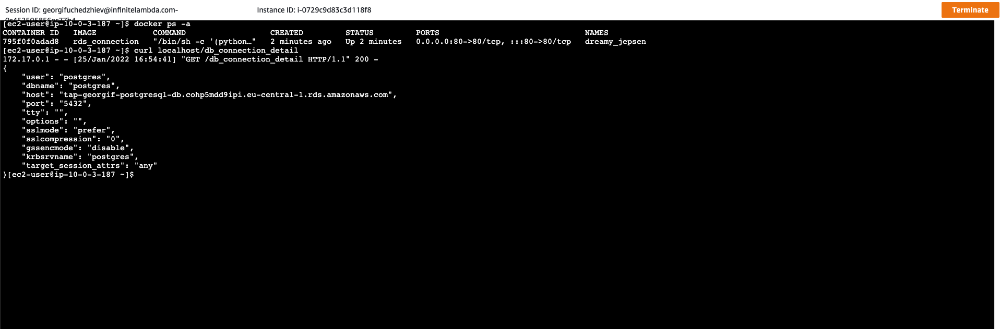

## AWS lab 6:

### Task 1:
Created the RDS within database subnets and stored the credentials in Secrets Manager:


### Task 2:

Added the following commands to user data in the instance configuration:

```bash
#!/bin/bash
sudo yum update
sudo amazon-linux-extras install -y postgresql13
```


### Task 3:

Verified that postgres service is running, connected to the database and listed the connection:


Managed to do ssh port forwarding via EC2 instance, although this could be wrong, since the instance must be private, nevertheless:


### Task 3 subsection b:

Created new private instance, installed ssm plugin on my localhost and created a tunnel to the postgres db:


### Task 4:

Created the snapshot:


Copied the snapshot to eu-west-1 and restored the database from it:


Created backup plan via AWS backup:


### Task 5:

Modified the database to be Multi-AZ:


Created the replica in region eu-west-1:


Promoted the replica to instance in region eu-west-1:


### Task 6:

Created the EC2 instance in database subnet:



Installed docker via user data:

```bash
#!/bin/bash
sudo yum update
sudo amazon-linux-extras install -y docker
sudo systemctl enable --now docker.service
sudo usermod -aG docker ec2-user
```

Python application for connection details to the RDS:

```python
#!/usr/bin/python3
from psycopg2 import connect
import os
import json
import time

def state_to_file():
    try:
        conn = connect (
        dbname = "",
        user = os.environ.get('DATABASE_USER'),
        host = os.environ.get('DATABASE_HOST'),
        password = os.environ.get('DATABASE_PASS')
        )

        dsm_param = conn.get_dsn_parameters()
        info = json.dumps(dsm_param, indent=4)

        with open('state/db_connection_detail', 'w') as f:
            f.write(info)

    except Exception as err:
        print ("\npsycopg2 connection error:", err)

    time.sleep(30)
    state_to_file()

state_to_file()
```

Dockerfile that runs the python application and http server:

```python
FROM python:alpine

WORKDIR /script

ENV DATABASE_USER=$DATABASE_USER
ENV DATABASE_HOST=$DATABASE_HOST
ENV DATABASE_PASS=$DATABASE_PASS

COPY requirements.txt requirements.txt

RUN pip3 install -r requirements.txt

COPY . .

EXPOSE 80

CMD [ "/bin/sh", "-c", "(python3 db_connection_state.py &) && python3 -m http.server --directory state 80" ]
```

Running container and RDS connection state:


