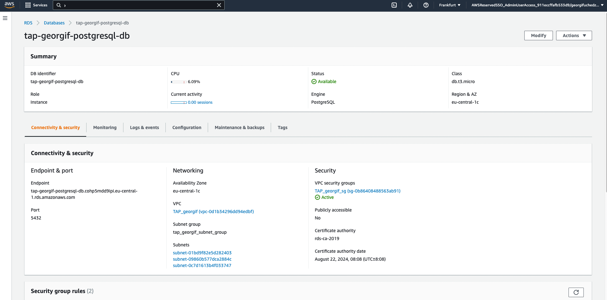

## AWS lab 6:

### Task 1:
Created the RDS within database subnets and stored the credentials in Secrets Manager:




### Task 2:

Added the following commands to user data in the instance configuration:

```bash
#!/bin/bash
sudo yum update
sudo amazon-linux-extras install -y postgresql13
```


### Task 3:

Verified that postgres service is running, connected to the database and listed the connection:


Managed to do ssh port forwarding via EC2 instance, although this could be wrong, since the instance must be private, nevertheless:


### Task 3 subsection b:

Created new private instance, installed ssm plugin on my localhost and created a tunnel to the postgres db:


### Task 4:

Created the snapshot:


Copied the snapshot to eu-west-1 and restored the database from it:


Created backup plan via AWS backup:


### Task 5:

Modified the database to be Multi-AZ:


Created the replica in region eu-west-1:


Promoted the replica to instance in region eu-west-1:


