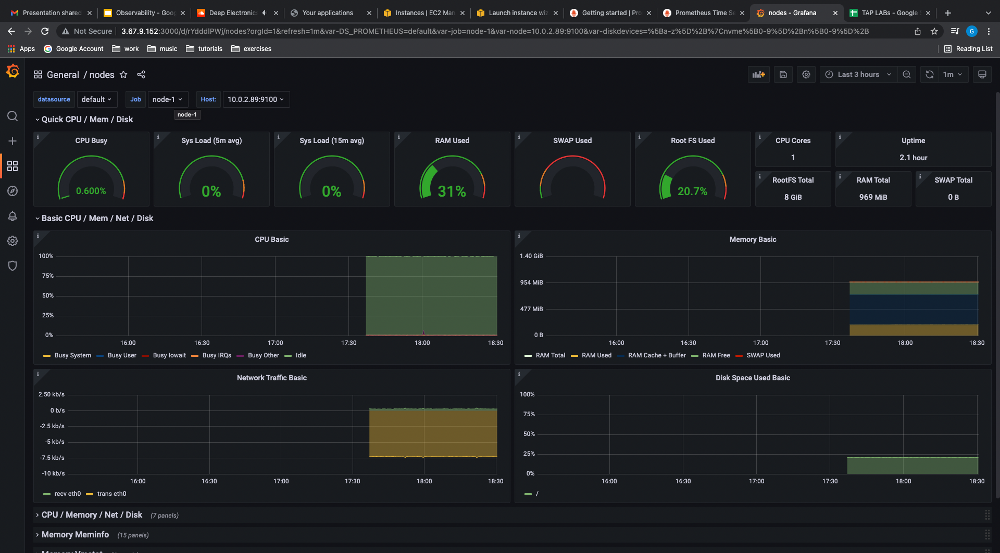
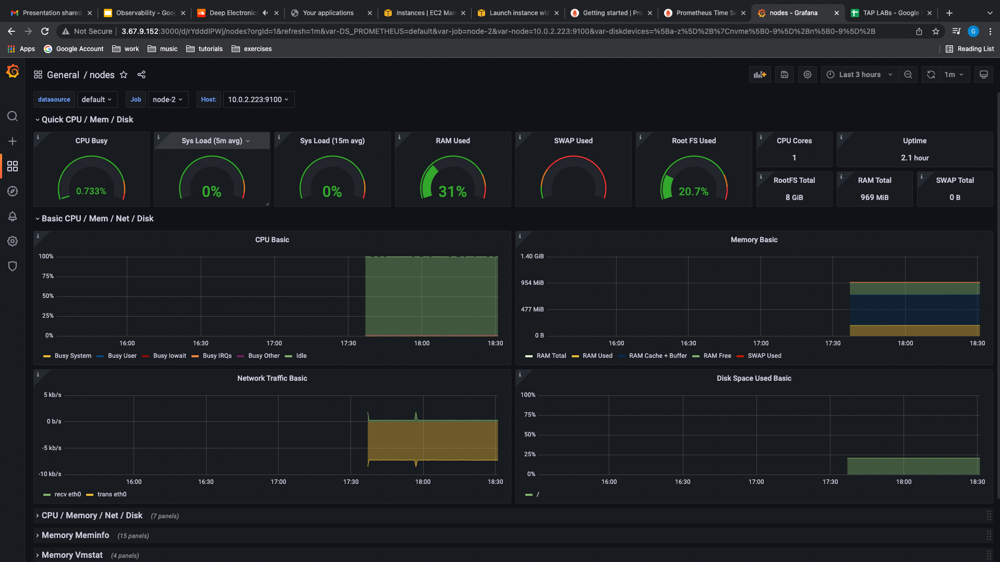

## Observability task day 1:

### Terraform code for the infrastructure:

```bash
module "vpc" {
  source = "terraform-aws-modules/vpc/aws"
  #source = "./.terraform/modules/vpc"

  name = "gf_observe"
  cidr = "10.0.0.0/16"

  azs             = ["eu-central-1a", "eu-central-1b" ]
  public_subnets  = ["10.0.1.0/24", "10.0.2.0/24"]

  enable_dns_hostnames = true
  enable_dns_support   = true

  tags = {
    Name = "gf_observe"
  }
}

resource "aws_default_security_group" "observer" {
  vpc_id = module.vpc.vpc_id

  ingress {
    from_port = 22
    to_port   = 22
    protocol  = "TCP"
    cidr_blocks = ["0.0.0.0/0"]
  }

  ingress {
    from_port = 3000
    to_port   = 3000
    protocol  = "TCP"
    cidr_blocks = ["0.0.0.0/0"]
  }

  ingress {
    from_port = 9090
    to_port   = 9090
    protocol  = "TCP"
    cidr_blocks = ["0.0.0.0/0"]
  }

  egress {
    from_port = 0
    to_port   = 0
    protocol  = "-1"
    cidr_blocks = ["0.0.0.0/0"]
  }
}

resource "aws_security_group" "nodes" {
  name = "nodes"
  description = "EC2 instances being observed."
  vpc_id = module.vpc.vpc_id

  ingress {
    from_port = 22
    to_port   = 22
    protocol  = "TCP"
    cidr_blocks = ["0.0.0.0/0"]
  }

  ingress {
    from_port = 9100
    to_port   = 9100
    protocol  = "TCP"
    cidr_blocks = [module.vpc.vpc_cidr_block]
  }

  egress {
    from_port = 0
    to_port   = 0
    protocol  = "-1"
    cidr_blocks = ["0.0.0.0/0"]
  }
}

resource "aws_instance" "nodes" {
  for_each = toset(["node-1", "node-2"])

  ami                    = "ami-0d527b8c289b4af7f"
  instance_type          = "t2.micro"
  key_name               = "TAP_georgif"
  vpc_security_group_ids = [aws_security_group.nodes.id]
  subnet_id = module.vpc.public_subnets[1]
  associate_public_ip_address = true
  user_data = <<EOF
#!/bin/bash
sudo apt update
sudo apt install -y prometheus-node-exporter

EOF

  tags = {
    Name = "${each.value}"
  }
}

module "ec2_instance" {
  source  = "terraform-aws-modules/ec2-instance/aws"
  #source  = "./.terraform/modules/ec2_instance"
  version = "~> 3.0"

  name = "observer"

  ami                    = "ami-0d527b8c289b4af7f"
  instance_type          = "t2.micro"
  key_name               = "TAP_georgif"
  vpc_security_group_ids = [module.vpc.default_security_group_id]
  subnet_id              = module.vpc.public_subnets[0]
  associate_public_ip_address = true
  user_data = <<EOF
#!/bin/bash
wget -q -O - https://packages.grafana.com/gpg.key | sudo apt-key add -
echo "deb https://packages.grafana.com/oss/deb stable main" | sudo tee -a /etc/apt/sources.list.d/grafana.list
sudo apt update
sudo apt install -y prometheus jq
sudo apt install -y apt-transport-https
sudo apt install -y software-properties-common
sudo apt install -y grafana
sudo systemctl daemon-reload
sudo systemctl enable --now grafana-server.service
EOF

  tags = {
    Name = "observer"
  }
}
```

### Adjusted prometheus configuration with nodes's private ip addresses:

```bash
ssh -i /Users/gf/Documents/TAP_georgif.pem ubuntu@3.67.9.152 tail -n 11 /etc/prometheus/prometheus.yml
```

```bash
  - job_name: node-1
    # If prometheus-node-exporter is installed, grab stats about the local
    # machine by default.
    static_configs:
      - targets: ['10.0.2.89:9100']

  - job_name: node-2
    # If prometheus-node-exporter is installed, grab stats about the local
    # machine by default.
    static_configs:
      - targets: ['10.0.2.223:9100']
```

### Grafana running with stats from nodes:




