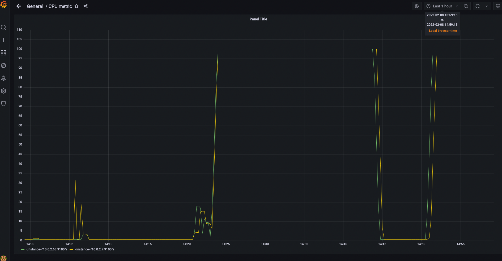

## Observability task day 2:

### Created average CPU usage for both nodes and excluded idle time:

```bash
100 - (avg by (instance) (rate(node_cpu_seconds_total{mode="idle"}[1m])) * 100)
```

### Added rules.yml in /etc/prometheus and linked it in glolab configuration file /etc/prometheus/prometheus.yml. Content:

```bash
groups:
- name: TestingNodes
  rules:
  - alert: High_CPU_Usage
    # Condition for alerting
    expr: 100 - (avg by (instance) (rate(node_cpu_seconds_total{mode="idle"}[1m])) * 100) > 95
    for: 5m
    # Annotation - additional informational labels to store more information
    annotations:
      title: 'High average CPU usage on testing nodes'
      description: 'High average CPU usage on testing nodes for more than 5 minutes.'
    # Labels - additional labels to be attached to the alert
    labels:
      severity: 'critical'
```

### Installed prometheus-alertmanager and appended slack notification for the testing channel:

```bash
sudo apt install -y prometheus-alertmanager
```

```bash
global:
  resolve_timeout: 1m
  slack_api_url: ''

route:
  receiver: 'slack-notifications'

receivers:
- name: 'slack-notifications'
  slack_configs:
  - channel: '#tap-devops-2021-for-lambda-testing'
    send_resolved: true
```

```bash
sudo systemctl restart prometheus-alertmanager.service
```

### Installed stress tool on both nodes and ran it:

```bash
for ip in "18.194.233.115" "18.197.183.190";do ssh -i ~/Documents/TAP_georgif.pem ubuntu@$ip "sudo apt update ; sudo apt install -y stress";done
```

```bash
for ip in "18.194.233.115" "18.197.183.190";do ssh -i ~/Documents/TAP_georgif.pem ubuntu@$ip "stress --cpu 1 --timeout 10m &";done
```

### Results:





