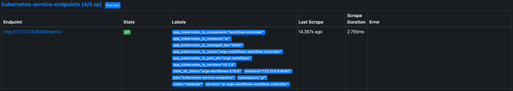
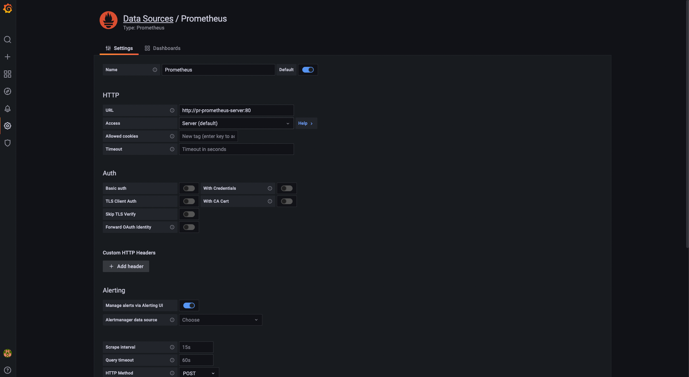
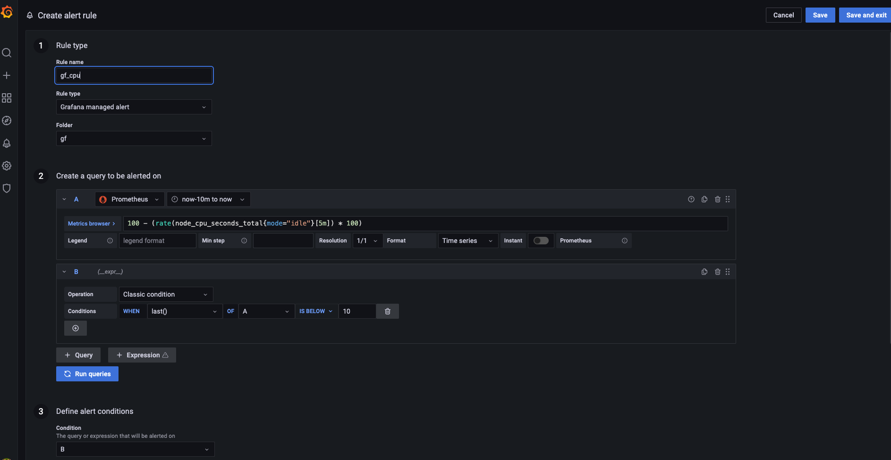
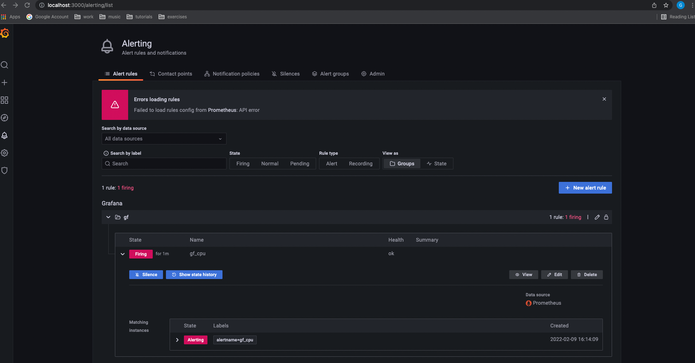

## Observability tasks day 3:

### Created minikube cluster, namespace gf and installed prometheus:

```bash
minikube start

kubectl create namespace gf

helm install pr -f values.yaml prometheus-community/prometheus --namespace gf
```

### Installed argo-workflows and added the following in under serviceAnnotations for controller service in values.yaml file:

```bash
helm install ar -f ar-values/values.yaml argo/argo-workflows --namespace gf
```

```bash
    prometheus.io/scrape: "true"
    prometheus.io/path: /metrics
    prometheus.io/port: "9090"
```

### Prometheus scraping information from argo-workflows pod:



### Installed grafana with helm:

```bash
helm install gr grafana/grafana --namespace gf
```

All pods in namespace gf:

```bash
NAME                                                    READY   STATUS    RESTARTS   AGE
ar-argo-workflows-server-54dd9844b7-fq2b2               1/1     Running   0          71m
ar-argo-workflows-workflow-controller-67c4cfb68-vw5qn   1/1     Running   0          71m
gr-grafana-848fb4f6bc-52pxs                             1/1     Running   0          68m
pr-kube-state-metrics-8c768ddc4-b7p24                   1/1     Running   0          80m
pr-prometheus-alertmanager-0                            2/2     Running   0          80m
pr-prometheus-node-exporter-zjq6t                       1/1     Running   0          80m
pr-prometheus-pushgateway-69c786ffb8-gv4sk              1/1     Running   0          80m
pr-prometheus-server-6f6c95bf45-d2t7w                   2/2     Running   0          80m
```

### Grafana configuration and alert:






