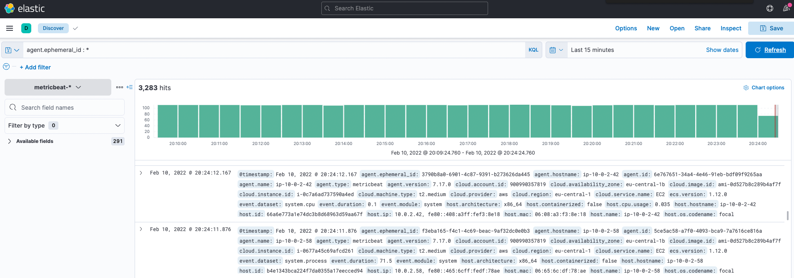

## Observability tasks day 4:

### Installation of ELK is done via user data option, snippet from Terraform:

```bash
user_data = <<EOF
#!/bin/bash
wget -qO - https://artifacts.elastic.co/GPG-KEY-elasticsearch | sudo apt-key add -
sudo apt-get install apt-transport-https
echo "deb https://artifacts.elastic.co/packages/7.x/apt stable main" | sudo tee /etc/apt/sources.list.d/elastic-7.x.list
sudo apt-get update && sudo apt-get install -y elasticsearch kibana logstash
sudo systemctl enable --now elasticsearch.service

EOF
```

The above configuration is for the master node. On the worker nodes only elasticsearch is installed.

Private IP addresses from AWS:

```bash
elk-master: 10.0.1.224 
elk-w1: 10.0.2.58 
elk-w2: 10.0.2.42 
```

### Cluster and nodes configuration in /etc/elasticsearch/elasticsearch.yml:

```bash
cluster.name: gf-elk
node.name: elk-master
node.master: true
node.data: false
path.data: /var/lib/elasticsearch
path.logs: /var/log/elasticsearch
network.host: 10.0.1.224
http.port: 9200
discovery.zen.ping.unicast.hosts: ["10.0.1.224", "10.0.2.58", "10.0.2.42"]
cluster.initial_master_nodes: ["elk-master"]

cluster.name: gf-elk
node.name: elk-w1
node.data: true
path.data: /var/lib/elasticsearch
path.logs: /var/log/elasticsearch
network.host: 10.0.2.58
http.port: 9200
discovery.zen.ping.unicast.hosts: ["10.0.1.224", "10.0.2.58", "10.0.2.42"]
cluster.initial_master_nodes: ["elk-master”]

cluster.name: gf-elk
node.name: elk-w2
node.data: true
path.data: /var/lib/elasticsearch
path.logs: /var/log/elasticsearch
network.host: 10.0.2.42
http.port: 9200
discovery.zen.ping.unicast.hosts: ["10.0.1.224", "10.0.2.58", "10.0.2.42"]
cluster.initial_master_nodes: ["elk-master"]
```

Cluster health:

```bash
curl 10.0.1.224:9200/_cluster/health?pretty
{
  "cluster_name" : "gf-elk",
  "status" : "green",
  "timed_out" : false,
  "number_of_nodes" : 3,
  "number_of_data_nodes" : 2,
  "active_primary_shards" : 10,
  "active_shards" : 20,
  "relocating_shards" : 0,
  "initializing_shards" : 0,
  "unassigned_shards" : 0,
  "delayed_unassigned_shards" : 0,
  "number_of_pending_tasks" : 0,
  "number_of_in_flight_fetch" : 0,
  "task_max_waiting_in_queue_millis" : 0,
  "active_shards_percent_as_number" : 100.0
}
```

### Modified /etc/kibana/kibana.yml on the master node:

```bash
server.port: 5601
server.host: "0.0.0.0"
elasticsearch.hosts: ["http://10.0.1.224:9200"]
```
### Installed metricsbeat manually on each worker node, edited the configuration files and started the service:

```bash
sudo apt install -y metricsbeat
```

File /etc/metricsbeat/metricsbeat.yml config:

```bash
setup.kibana:
  host: "10.0.1.224:5601"
output.elasticsearch:
  hosts: ["10.0.2.58:9200"] #Same config for the other worker node, but with IP address 10.0.2.42.
```

```bash
metricbeat modules enable elasticsearch
```

File /etc/metricbeat/modules.d/elasticsearch.yml config:

```bash
- module: elasticsearch
  period: 10s
  hosts: ["http://10.0.2.58:9200"] #Same config for the other worker node, but with IP address 10.0.2.42.
```

```bash
metricbeat setup

service metricbeat start
```

### Results:


