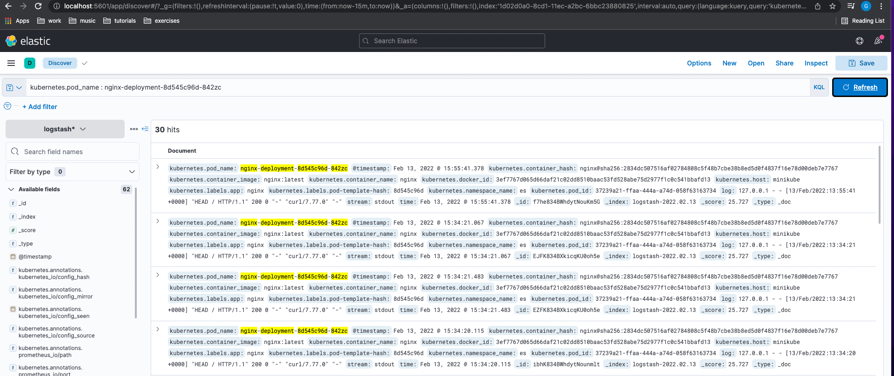

## Observability tasks day 5:

## Task 1:

### Installed filebeat, got the sample logs, configured and started the service:

```bash
apt install -y filebeat

wget https://download.elastic.co/demos/logstash/gettingstarted/logstash-tutorial.log.gz
```

File /etc/filebeat/filebeat.yml content:

```bash
filebeat.inputs:
- type: log
  enabled: true
  paths:
    - /var/log/logstash-tutorial.log
  hosts: ["localhost:5044"]
filebeat.config.modules:
  path: ${path.config}/modules.d/*.yml
  reload.enabled: false
setup.template.settings:
  index.number_of_shards: 1
output.logstash:
    hosts: ["10.0.1.224:5044"]
processors:
  - add_host_metadata:
      when.not.contains.tags: forwarded
  - add_cloud_metadata: ~
  - add_docker_metadata: ~
  - add_kubernetes_metadata: ~
```

```bash
systemctl enable filbert
```

### Allowed ingress on 5044 for the main node and configured pipeline /etc/logstash/gf-pipeline.conf on it:

```bash
input {
    beats {
        port => "5044"
    }
}
filter {
    grok {
        match => { "message" => "%{COMBINEDAPACHELOG}"}
    }
    geoip {
	source => "clientip"
    }
}
output {
    elasticsearch {
        hosts => [ "10.0.1.224:9200" ]
    }
}
```

### Created logstash index in Kibana and got the results:


## Task 2:

### Namespace:

```bash
kubectl create namespace es
```

### Nginx deployment:

```bash
---
apiVersion: apps/v1
kind: Deployment
metadata:
  name: nginx-deployment
  namespace: es
spec:
  selector:
    matchLabels:
      app: nginx
  replicas: 1 
  template:
    metadata:
      labels:
        app: nginx
    spec:
      containers:
      - name: nginx
        image: nginx:latest
        ports:
        - containerPort: 80
```

```bash
kubectl port-forward deployment/nginx-deployment 8000:80 -n es &
```

```bash
curl -IL localhost:8000
```

```bash
HTTP/1.1 200 OK
Server: nginx/1.21.6
Date: Sun, 13 Feb 2022 10:14:47 GMT
Content-Type: text/html
Content-Length: 615
Last-Modified: Tue, 25 Jan 2022 15:03:52 GMT
Connection: keep-alive
ETag: "61f01158-267"
Accept-Ranges: bytes
```

### ES and Kibana installation via helm:

```bash
helm repo add elastic https://helm.elastic.co
```

Enabled minikube addons:

```bash
minikube addons enable storage-provisioner

minikube addons enable default-storageclass
```

Used example values from https://github.com/elastic/helm-charts/blob/main/elasticsearch/examples/minikube/values.yaml for Elasticsearch install:

```bash
---
# Permit co-located instances for solitary minikube virtual machines.
antiAffinity: "soft"

# Shrink default JVM heap.
esJavaOpts: "-Xmx128m -Xms128m"

# Allocate smaller chunks of memory per pod.
resources:
  requests:
    cpu: "100m"
    memory: "512M"
  limits:
    cpu: "1000m"
    memory: "512M"

# Request smaller persistent volumes.
volumeClaimTemplate:
  accessModes: [ "ReadWriteOnce" ]
  storageClassName: "standard"
  resources:
    requests:
      storage: 100M
```

```bash
helm install es elastic/elasticsearch -f es-values.yaml -n es

helm install kibana elastic/kibana -n es
```

### Fluent bit installation - https://docs.fluentbit.io/manual/installation/kubernetes#installation :

```bash
kubectl create namespace logging

kubectl create -f https://raw.githubusercontent.com/fluent/fluent-bit-kubernetes-logging/master/fluent-bit-service-account.yaml

kubectl create -f https://raw.githubusercontent.com/fluent/fluent-bit-kubernetes-logging/master/fluent-bit-role-1.22.yaml

kubectl create -f https://raw.githubusercontent.com/fluent/fluent-bit-kubernetes-logging/master/fluent-bit-role-binding-1.22.yaml
```

For the daemon set I've changed the default FQDN for ES service on the cluster:

```bash
value: "elasticsearch-master.es.svc.cluster.local"
```

```bash
kubectl create -f fluent-bit-ds-minikube.yaml
```

### Results:

```bash 
kubectl -n es get pods | grep nginx

nginx-deployment-8d545c96d-842zc   1/1     Running   0             109m
```


