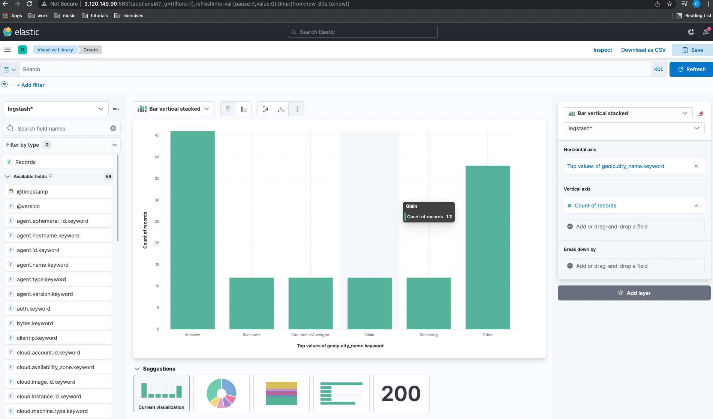

## Observability tasks day 5:

## Task 1:

### Installed filebeat, got the sample logs, configured and started the service:

```bash
apt install -y filebeat

wget https://download.elastic.co/demos/logstash/gettingstarted/logstash-tutorial.log.gz
```

File /etc/filebeat/filebeat.yml content:

```bash
filebeat.inputs:
- type: log
  enabled: true
  paths:
    - /var/log/logstash-tutorial.log
  hosts: ["localhost:5044"]
filebeat.config.modules:
  path: ${path.config}/modules.d/*.yml
  reload.enabled: false
setup.template.settings:
  index.number_of_shards: 1
output.logstash:
    hosts: ["10.0.1.224:5044"]
processors:
  - add_host_metadata:
      when.not.contains.tags: forwarded
  - add_cloud_metadata: ~
  - add_docker_metadata: ~
  - add_kubernetes_metadata: ~
```

```bash
systemctl enable filbert
```

### Allowed ingress on 5044 for the main node and configured pipeline /etc/logstash/gf-pipeline.conf on it:

```bash
input {
    beats {
        port => "5044"
    }
}
filter {
    grok {
        match => { "message" => "%{COMBINEDAPACHELOG}"}
    }
    geoip {
	source => "clientip"
    }
}
output {
    elasticsearch {
        hosts => [ "10.0.1.224:9200" ]
    }
}
```

### Created logstash index in Kibana and got the results:


