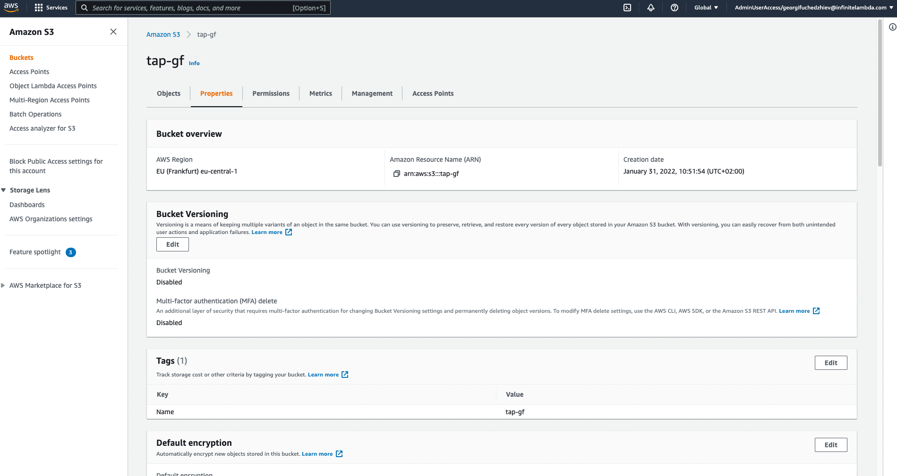

## Terraform day 1 tasks:

### Task 1




```bash
terraform {
  backend "s3" {
    bucket         = "tap-gf"
    key            = "terraform.tfstate"
    region         = "eu-central-1"
    dynamodb_table = "tap-gf-table"
  }

  required_providers {
    aws = {
      source  = "hashicorp/aws"
      version = "~> 3.27"
    }
  }
  required_version = ">= 1.0.0"
}

provider "aws" {
  profile = "default"
  region  = "eu-central-1"
}
```

### Task 2

```bash
#Virtual private cloud creation:

resource "aws_vpc" "tap_gf_vpc_ec2" {
  cidr_block       = "10.0.0.0/16"
  instance_tenancy = "default"
  tags = {
    Name = "tap_gf_vpc_ec2"
  }
}

#Subnet creation for vpc ec2:

resource "aws_subnet" "tap_gf_ec2_sn" {
  vpc_id            = aws_vpc.tap_gf_vpc_ec2.id
  cidr_block        = "10.0.1.0/24"
  availability_zone = "eu-central-1a"
  tags = {
    Name = "tap_gf_ec2_sn"
  }
}

#Internet gateway creation for vpc ec2:

resource "aws_internet_gateway" "tap_gf_igw_ec2" {
  vpc_id = aws_vpc.tap_gf_vpc_ec2.id
  tags = {
    Name = "tap_gf_igw_ec2"
  }
}

#Route table creation (including public and peering connections) for vpc ec2 and making it main:

resource "aws_route_table" "tap_gf_ec2_rt" {
  vpc_id = aws_vpc.tap_gf_vpc_ec2.id
  route {
    cidr_block = "0.0.0.0/0"
    gateway_id = aws_internet_gateway.tap_gf_igw_ec2.id
  }
  route {
    cidr_block = "10.1.0.0/16"
    vpc_peering_connection_id = aws_vpc_peering_connection.tap_gf_ec2_rds_peering.id
  }
  tags = {
    Name = "tap_gf_ec2_rt"
  }
}

resource "aws_main_route_table_association" "tap_gf_ec2_rt_main" {
  vpc_id         = aws_vpc.tap_gf_vpc_ec2.id
  route_table_id = aws_route_table.tap_gf_ec2_rt.id
}

#Security group creation allowing SSH connection from my public IP only using environment variable:

variable "IP" {}

resource "aws_security_group" "tap_gf_ec2_ssh" {
  name        = "SSH"
  description = "Allow SSH"
  vpc_id      = aws_vpc.tap_gf_vpc_ec2.id
  ingress {
    from_port   = 22
    to_port     = 22
    protocol    = "tcp"
    cidr_blocks = [var.IP]
  }
  egress {
    from_port   = 0
    to_port     = 0
    protocol    = "-1"
    cidr_blocks = ["0.0.0.0/0"]
  }
  tags = {
    Name = "allow_ssh"
  }
}

#Instance creation and connecting via existing ssh key.

resource "aws_instance" "tap_gf_ec2_ubuntu" {
  ami                         = "ami-0d527b8c289b4af7f"
  instance_type               = "t3.micro"
  subnet_id                   = aws_subnet.tap_gf_ec2_sn.id
  vpc_security_group_ids      = [aws_security_group.tap_gf_ec2_ssh.id]
  availability_zone           = "eu-central-1a"
  associate_public_ip_address = true
  key_name                    = "TAP_georgif"
  tags = {
    Name = "tap_gf_ec2_ubuntu"
  }
}
```

### EC2 is accessible:

```bash
ssh -i /Users/gf/Documents/TAP_georgif.pem ubuntu@18.156.128.127 id
```

```bash
uid=1000(ubuntu) gid=1000(ubuntu) groups=1000(ubuntu),4(adm),20(dialout),24(cdrom),25(floppy),27(sudo),29(audio),30(dip),44(video),46(plugdev),117(netdev),118(lxd)
```

### Task 3

```bash
#Virtual private cloud creation:

resource "aws_vpc" "tap_gf_vpc_rds" {
  cidr_block       = "10.1.0.0/16"
  instance_tenancy = "default"
  tags = {
    Name = "tap_gf_vpc_rds"
  }
}

#Subnets for vpc rds creation:

resource "aws_subnet" "tap_gf_rds_sn_1" {
  vpc_id            = aws_vpc.tap_gf_vpc_rds.id
  cidr_block        = "10.1.5.0/24"
  availability_zone = "eu-central-1a"
  tags = {
    Name = "tap_gf_rds_sn"
  }
}

resource "aws_subnet" "tap_gf_rds_sn_2" {
  vpc_id            = aws_vpc.tap_gf_vpc_rds.id
  cidr_block        = "10.1.6.0/24"
  availability_zone = "eu-central-1b"
  tags = {
    Name = "tap_gf_rds_sn"
  }
}

#Route table creation for vpc rds and making the table main:

resource "aws_route_table" "tap_gf_rds_rt" {
  vpc_id = aws_vpc.tap_gf_vpc_rds.id
  route {
    cidr_block = "10.0.0.0/16"
    vpc_peering_connection_id = aws_vpc_peering_connection.tap_gf_ec2_rds_peering.id
  }
  tags = {
    Name = "tap_gf_rds_rt"
  }
}

resource "aws_main_route_table_association" "tap_gf_rds_rt_main" {
  vpc_id         = aws_vpc.tap_gf_vpc_rds.id
  route_table_id = aws_route_table.tap_gf_rds_rt.id
}

resource "aws_security_group" "tap_gf_rds_sg" {
  name        = "tap_gf_rds_sg"
  description = "rds_sg"
  vpc_id      = aws_vpc.tap_gf_vpc_rds.id
  ingress {
    from_port   = 5432
    to_port     = 5432
    protocol    = "tcp"
    cidr_blocks = ["10.0.0.0/8"]
  }
  egress {
    from_port   = 0
    to_port     = 0
    protocol    = "-1"
    cidr_blocks = ["0.0.0.0/0"]
  }
  tags = {
    Name = "tap_gf_rds_sg"
  }
}

resource "aws_db_subnet_group" "tap_gf_sng" {
  name = "tap_gf_sng"
  subnet_ids = [aws_subnet.tap_gf_rds_sn_1.id, aws_subnet.tap_gf_rds_sn_2.id]
}

#Creating the rds instance using environmental variables to store user name and password:

variable "DB_USER" {}
variable "DB_PASS" {}

resource "aws_db_instance" "tap_gf_rds_instance" {
  allocated_storage    = 10
  engine               = "postgres"
  engine_version       = "13"
  instance_class       = "db.t3.micro"
  name                 = "gf_db"
  username             = var.DB_USER
  password             = var.DB_PASS
  skip_final_snapshot  = true
  db_subnet_group_name = aws_db_subnet_group.tap_gf_sng.id
  vpc_security_group_ids = [aws_security_group.tap_gf_rds_sg.id]
  tags = {
    Name = "tap_georgif_rds_instance"
  }
}
```

### Task 4 peering the two vpcs:

```bash
resource "aws_vpc_peering_connection" "tap_gf_ec2_rds_peering" {
  vpc_id        = aws_vpc.tap_gf_vpc_ec2.id
  peer_vpc_id   = aws_vpc.tap_gf_vpc_rds.id
  auto_accept   = true
  tags = {
    Name = "VPC peering between ec2 and rds"
  }
}
```


